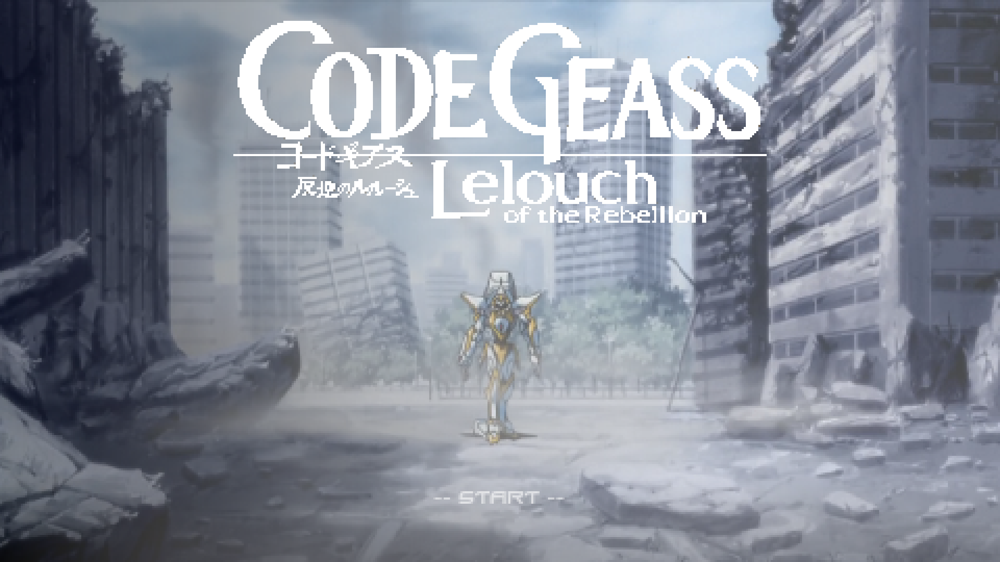
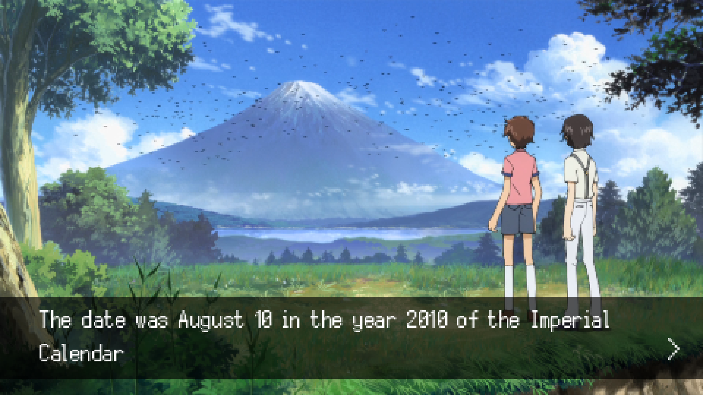
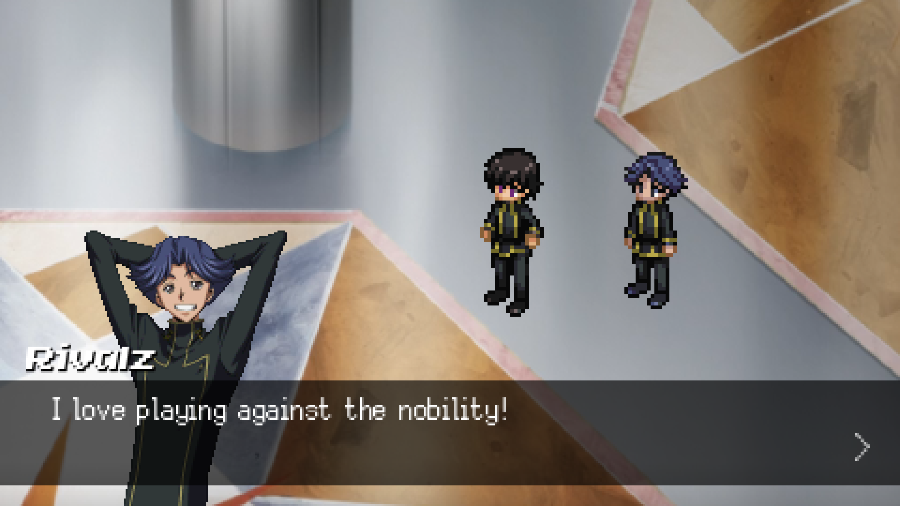
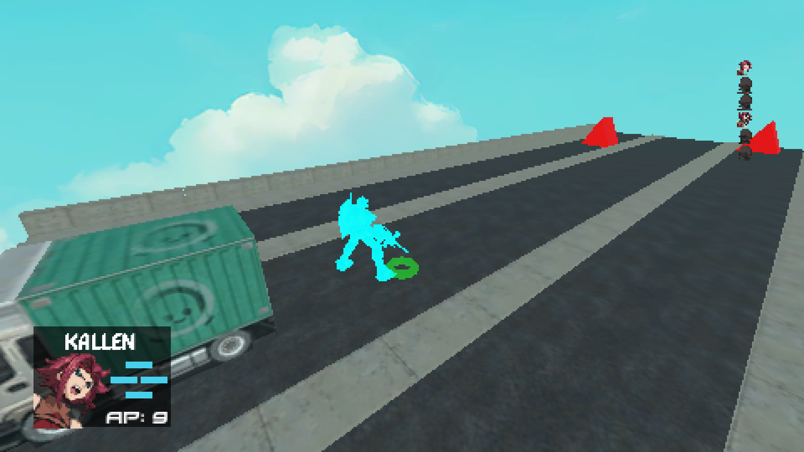
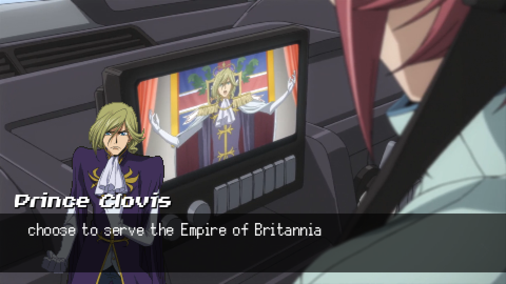
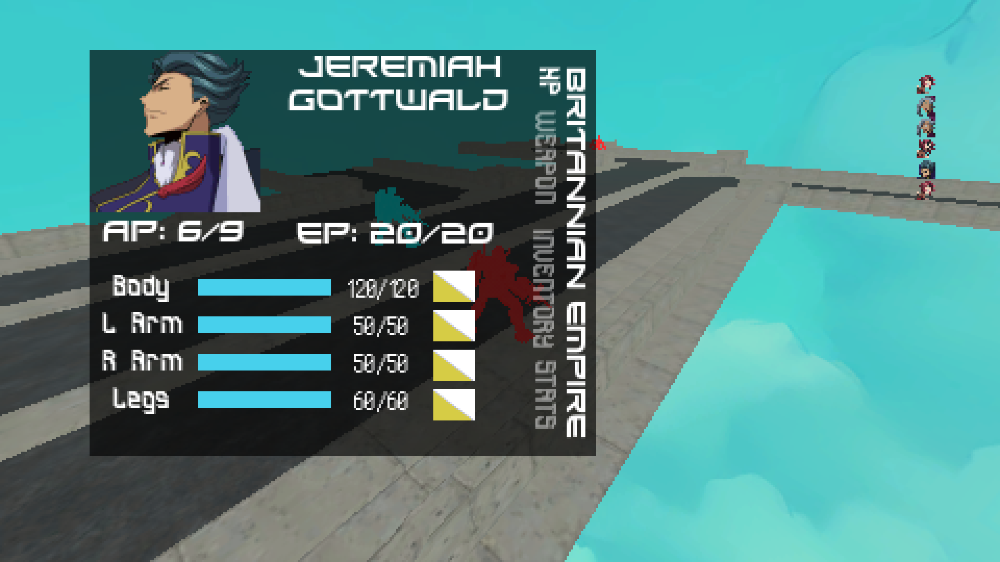

  

<h1 align="center">Code Geass: Lelouch of the Rebellion SRPG</h1>

  <a href="#about">About</a> •
  <a href="#downloads">Downloads</a> •
  <a href="#images">Images</a> •
  <a href="#controls">Controls</a> •
  <a href="#credits">Credits</a> •
  <a href="#contributions">Contributions</a> &
  <a href="#future-work">Future Work</a> •
  <a href="#license">License</a>

## About

Code Geass: Lelouch of the Rebellion is a sucessful and acclaimed 2006 anime by Sunrise. It features Lelouch in his attempts to destroy the Holy Britannian Empire. It was a pivotal show for me that has resulted in many friendships and even a great drinking game - and now my own video game! 

Using Godot I have attempted to recreate the early sections of the show ([The Shinjuku Incident](https://codegeass.fandom.com/wiki/Skirmish_in_Shinjuku_Ghetto)). Naturally, Code Geass should be a strategy game so [Fire Emblem](https://en.wikipedia.org/wiki/Fire_Emblem) was a major source of inspiration leading the design of the character's stats, selection and attack triangle typing. Being a mecha show, [Front Mission](https://en.wikipedia.org/wiki/Front_Mission) was also an obvious source of inspiration leading the design of the body parts and their hps. 

To play the game simply view the [Releases](https://github.com/henrylewis2004/Code-Geass-SRPG/releases/latest) page or go to [Downloads](#downloads).

The game is split into two sections: Story and Battle. With the Story sections narrating the story of the show through a visual-novel narritive and the Battle sections attempting to recreate battles from  the show. 

---

## Downloads

The project is available for Linux and Windows.

| Platform | Download |
|----------|----------|
| Latest Release | [Latest Release](https://github.com/henrylewis2004/Code-Geass-SRPG/releases/latest) |
| Linux (x86_64) | [Code-Geass-SRPG_linux.zip](https://github.com/henrylewis2004/Code-Geass-SRPG/releases/latest/download/Code-Geass-SRPG_linux.zip) |
| Windows (EXE) | [Code-Geass-SRPG_Windows.exe](https://github.com/henrylewis2004/Code-Geass-SRPG/releases/latest/download/Code-Geass-SRPG_Windows.exe) |

---

## Images

<h3 align="center">Main Menu</h3>

    

<h3 align="center">Story Prologue</h3>

    

<h3 align="center">Example Story Level</h3>

    

<h3 align="center">Example Battle Level</h2>

    

<h3 align="center">Example Story Level</h2>

    

<h3 align="center">Unit Status</h2>

    

---

## Controls

| Action | Controller Input | Keyboard Input |
|----------|----------|----------|
| Move Camera | Left Analog Stick | W, A, S, D |
| Rotate Camera | Right Analog Stick | Q, E |
| Accept | X, A | Enter, Space |
| Cancel | Circle, B | BackSpace |
| UI Move | Dpad | W, A, S, D, Arrow Keys |
| Enlarge Turn Order | Triangle, Y | CapsLock |
| Select Weapon | Square | F |
| Skip Video | START, MENU | Space |
| Reset Level | * | Ctrl + Esc |
| Delete Save Slot | * | Delete |

---

## Credits

The majority of the assets used where found elsewhere and imported into the project, the list is shown below. If I've forgotten something and left it out please inform me :).

### Fonts
| Use Case | Name |
|----------|----------|
| UI Text | [DPComic](https://www.1001fonts.com/dpcomic-font.html) |
| UI Text | [Good Timing](https://www.1001fonts.com/good-timing-font.html) |
| Header Text | [Invasion2000](https://www.1001fonts.com/invasion2000-font.html) |
| UI Text | [NeoBlock](https://fontesk.com/neoblock-font/) |
| Dialog Text | [Silver](https://poppyworks.itch.io/silver) |
| UI Text | [Xirod](https://www.1001fonts.com/xirod-font.html) |

### 2D Assets
| Use Case | Name |
|----------|----------|
| Various assets | [Code Geass: Lelouch of the Rebellion](https://www.spriters-resource.com/ds_dsi/codegeasslelouchoftherebellion/) |
| Backgrounds | [Screenshots taken from the show](https://www.crunchyroll.com/series/GY2P9ED0Y/code-geass?srsltid=AfmBOopmmUFh20CRF8oK6Vde0FwOEbzTH4rjH7fZSnbuxJJWQGsKCEgn) |
| Battle Skyboxes | [Painterly Sky Background](https://kalponic-studio.itch.io/painterly-sky-background) |
| Intro Video | [Code Geass Opening - COLORS by FLOW](https://www.youtube.com/watch?v=G8CFuZ9MseQ&list=RDG8CFuZ9MseQ&start_radio=1&pp=ygUPY29kZSBnZWFzcyBvcCAxoAcB) |

### 3D Assets
| Use Case | Name |
|----------|----------|
| Knightmare Frame Model | [RX-78-2 Gundam](https://models.spriters-resource.com/psp/kidousenshigundamgundamvsgundamnextplus/asset/292739/) |
| Environment models/details | [Kenney's Retro Urban Kit](https://kenney.nl/assets/retro-urban-kit) |
| Environment models/details | [Kenney's Retro Medieval Kit](https://kenney.nl/assets/retro-medieval-kit) |

### Music & SFX
| Use Case | Name |
|----------|----------|
| Music Tracks | [Code Geass Ost](https://codegeass.fandom.com/wiki/Music_Original_Sound_Track_(O.S.T.)) |
| SFX | [Code Geass: Lelouch of the Rebellion](https://sounds.spriters-resource.com/ds_dsi/codegeasslelouchoftherebellion/) |

---

## Contributions
Contributions are certainly welcome! 

I would also be more than willing to pick the project back up with any interested developers, or simply explain the systems and architecture in place.

## Future-Work
The most obvious area of future additions is more assets, specifically 3D assets. Additionally, new levels covering later episodes and key events of the show could be added - I initially started the project with [The Shinjuku Incident](https://codegeass.fandom.com/wiki/Skirmish_in_Shinjuku_Ghetto) and [The Battle of Narita](https://codegeass.fandom.com/wiki/Battle_of_Narita) as key inspiration. 
Further inspection of the game's loading times might also warrant success as they can be quite slow on weaker machines, likely due to the usage of *preloading* and *@onready* values. Further optimisation would be a valuable improvement.

### Asset Contribution Ideas
| Asset Type | Name |
|----------|----------|
| 3D Model | [Sutherland Knightmare Frame](https://codegeass.fandom.com/wiki/Sutherland) |
| 3D Model | [Glasgow Knightmare Frame](https://codegeass.fandom.com/wiki/Glasgow) |
| 3D Model | Helicopter |
| 2D Artwork | Various UI Elements |
| 2D Artwork | Weapon Type Images |
| 2D Artwork | Weapon Images |

---

## License

GPL-3.0 License — see [LICENSE](LICENSE) for details.

---
